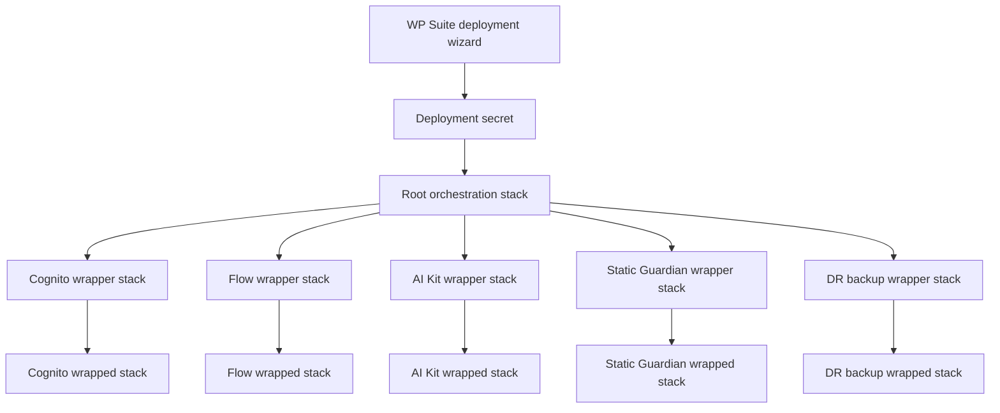
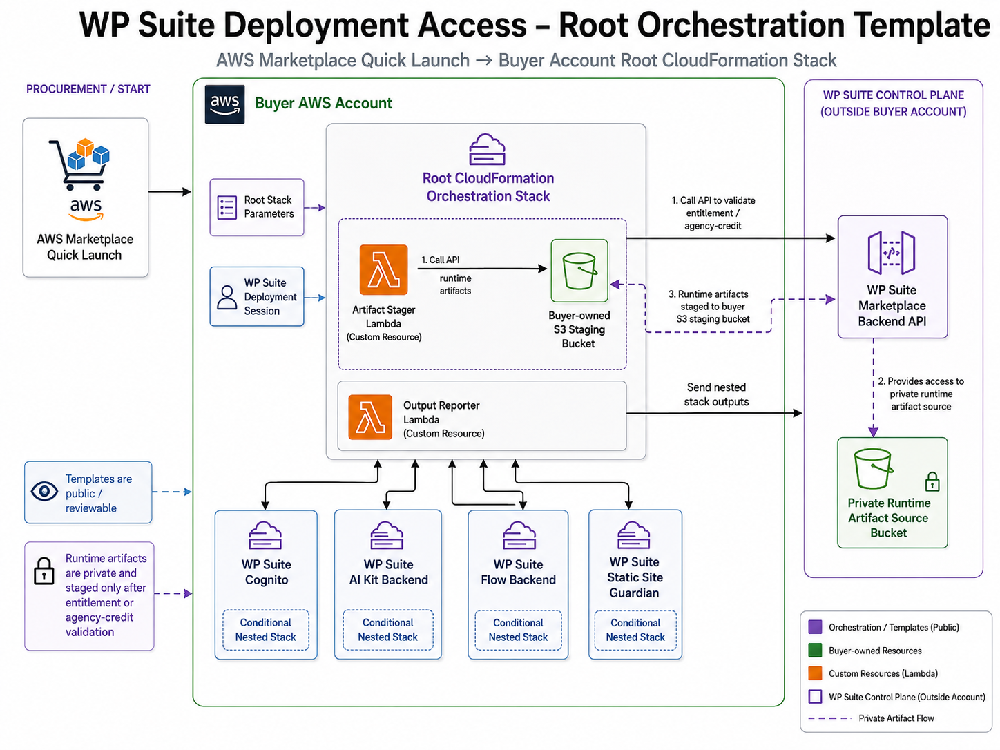
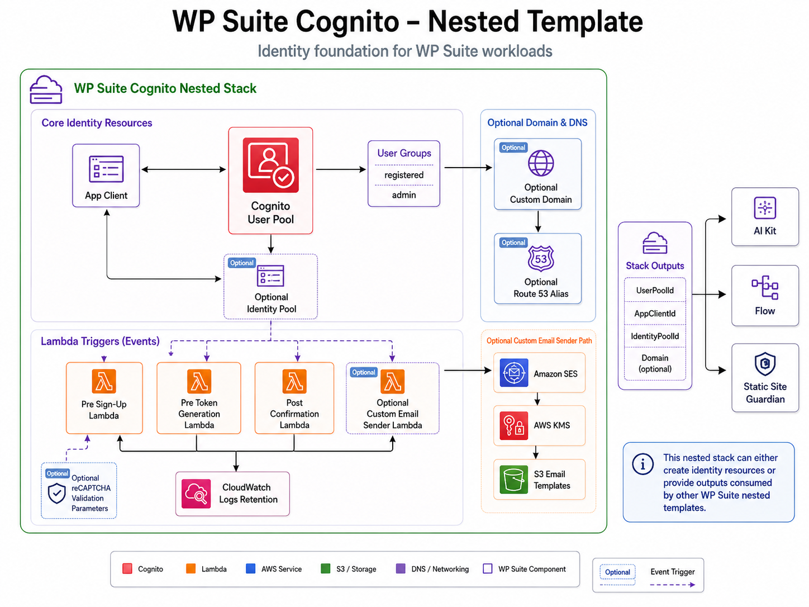
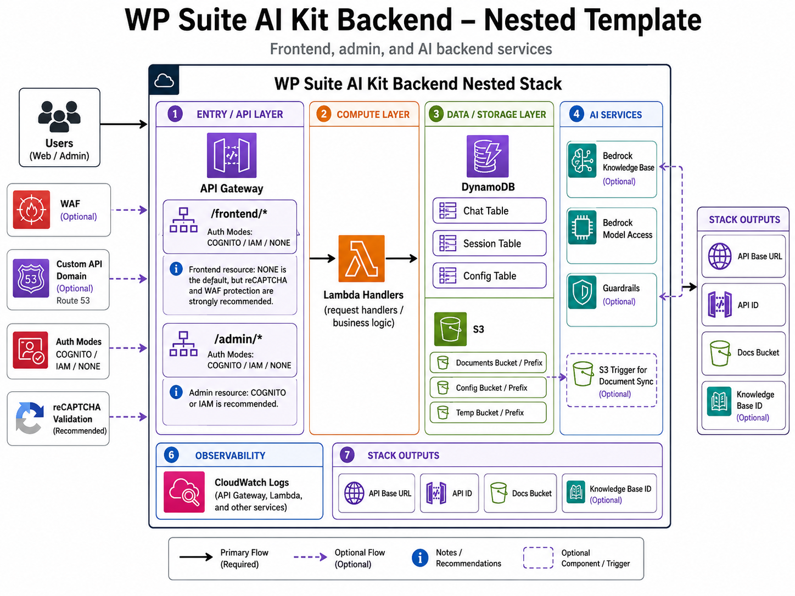
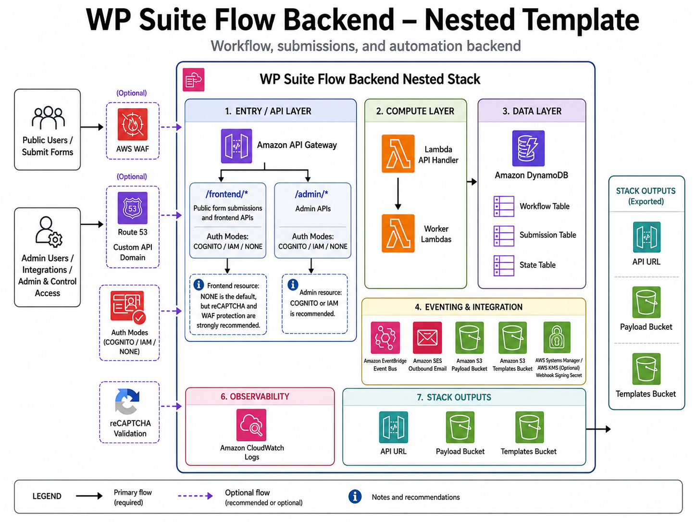
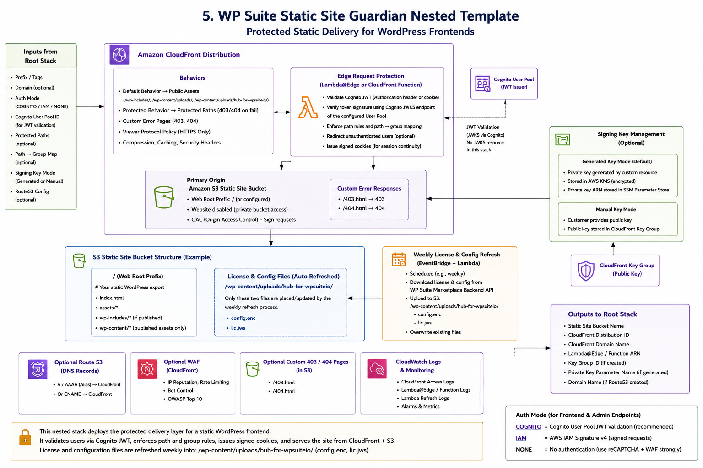

# Architecture overview

This document provides a visual review guide for the WP Suite Deployment Access CloudFormation templates.

The diagrams are intended to help buyers, AWS Marketplace reviewers, and security reviewers understand what each template creates in the buyer AWS account and how the public templates relate to the private runtime artifacts staged during an authorized deployment.

For the exact deployable definitions, review the generated YAML templates under `templates/`. For IAM-focused review notes, see [IAM permissions overview](iam-permissions.md).

## Quick Launch stack topology

Marketplace Quick Launch does not pass every buyer-selected parameter directly into the component templates. The deployment wizard first saves a short-lived deployment secret, then the buyer launches the root orchestration stack. A full deployment can use one root stack, five wrapper nested stacks, and five wrapped component stacks.

The root template creates the wrapper topology and passes deployment context to each wrapper. In Quick Launch mode, wrapper templates read component parameters from the deployment secret through CloudFormation dynamic references, then pass those values into the wrapped templates. The `Enabled` parameter controls whether the wrapped template creates the component resources. This means an unselected component can still have wrapper and wrapped nested stacks in the CloudFormation tree, while the actual component resources are suppressed by conditions.

The direct launch template follows the same component model, but receives explicit CloudFormation parameters instead of resolving them from a deployment secret.

## Root orchestration template

The root orchestration template is the Marketplace entry point. It receives the deployment session reference and selected topology, validates the deployment through the WP Suite control plane, stages private runtime artifacts into a buyer-owned S3 bucket, and creates the wrapper nested stacks that drive the wrapped component templates.

Key review points:

- Marketplace Quick Launch starts the buyer-account root CloudFormation stack.
- Public templates are reviewable before launch.
- Runtime artifacts remain private and are staged only after entitlement or agency-credit validation.
- Quick Launch parameters are stored in a deployment secret; wrappers resolve those values with dynamic references and forward them to wrapped templates.
- The wrapper/wrapped topology can appear for every supported component; component resources are controlled by the wrapped template `Enabled` parameter.
- Deployment outputs are reported back to the WP Suite control plane for later workspace/site configuration.
- Optional DR backup resources use AWS Backup scheduled backup plans and cross-Region copy for tagged WP Suite DynamoDB tables and S3 buckets. The template does not enable PITR or continuous backup.

## WP Suite Cognito nested template

The Cognito nested template provides the shared identity foundation for WP Suite workloads. It can create a new Cognito User Pool, app client, optional Identity Pool, groups, Lambda triggers, and optional custom-domain/email resources.

Key review points:

- Other nested stacks can consume the Cognito outputs for API authorization and protected static delivery.
- Identity Pool creation is optional.
- Lambda triggers are optional and controlled by template parameters.
- Custom domain, Route 53 alias, SES, KMS, S3 email templates, and reCAPTCHA settings are optional.

## WP Suite AI Kit Backend nested template

The AI Kit Backend nested template creates the API, Lambda, DynamoDB, S3, and optional Bedrock-related resources needed by WP Suite AI Kit paid features.

Key review points:

- API Gateway exposes frontend and admin resource groups with configurable authorization modes.
- Lambda handlers implement the backend request and business logic.
- DynamoDB stores chat sessions, chat messages, and knowledge-base sync state.
- S3 stores documents, prompt/configuration assets, and temporary assets; sensitive runtime configuration is stored in SSM parameters where required.
- Bedrock Knowledge Base, model access, guardrails, WAF, custom API domain, Route 53, and reCAPTCHA are optional/configurable.

## WP Suite Flow Backend nested template

The Flow Backend nested template creates the API, worker, storage, eventing, and integration resources used by WP Suite Flow paid features.

Key review points:

- API Gateway exposes frontend submission APIs and admin APIs with configurable authorization modes.
- Lambda functions handle API requests and background workflow processing.
- DynamoDB stores workflow, submission, and state records.
- S3 stores payloads and templates.
- EventBridge, SES, webhook signing secrets, WAF, Route 53, custom API domain, and reCAPTCHA are optional/configurable.

## WP Suite Static Site Guardian nested template

The Static Site Guardian nested template deploys a protected static delivery layer for WordPress frontends using CloudFront, S3, Cognito-compatible JWT validation, and optional signing-key management.

Key review points:

- CloudFront serves public and protected paths from a private S3 origin.
- Edge request protection validates Cognito JWTs and enforces path/group rules.
- Signing keys can be generated and managed by the stack or supplied manually.
- Optional Route 53 records, custom error pages, detailed logging, and WP Suite license/config refresh are configurable.
- The current Static Site Guardian template does not create WAF resources; API WAF controls are implemented in the AI Kit and Flow backend templates.
- Stack outputs provide the bucket, distribution, domain, key, and refresh-related identifiers needed by downstream WP Suite configuration.

## WP Suite DR Backup nested template

The DR Backup nested template creates scheduled AWS Backup resources for disaster recovery across Regions. It selects WP Suite resources by deployment-scoped tags and copies recovery points from a source-region vault to a destination-region vault.

Key review points:

- The template creates a source backup vault in the deployment Region and a destination vault in the selected secondary Region.
- Backup selection is tag-based and scoped to resources tagged for the same WP Suite deployment.
- DynamoDB tables and S3 buckets can be included independently.
- Backups are scheduled. PITR and continuous backup are intentionally not enabled by this template.
- The destination vault is created by a custom resource so buyers do not need to pre-create infrastructure in the secondary Region.
